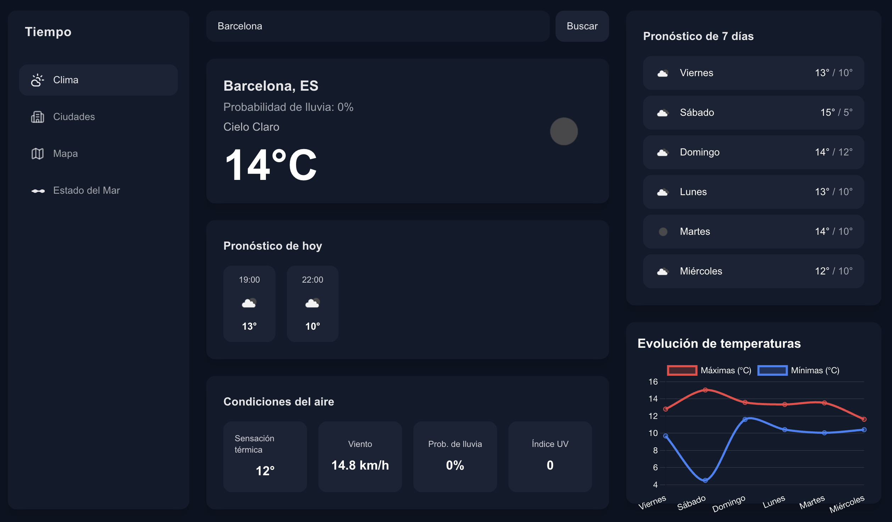
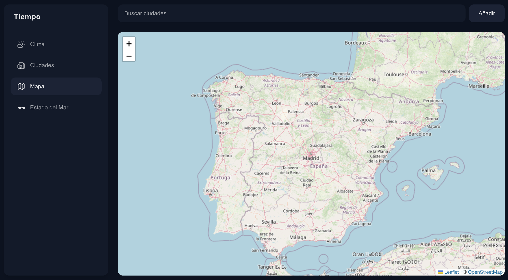
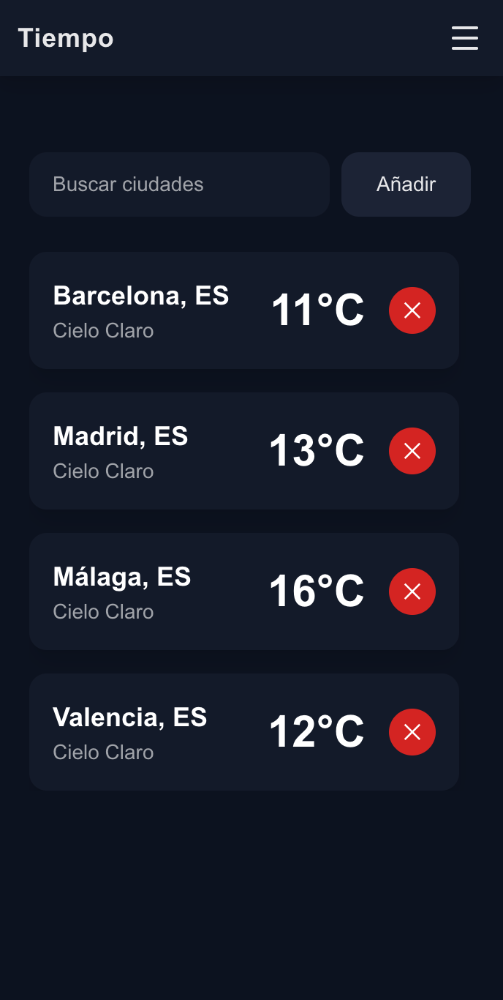
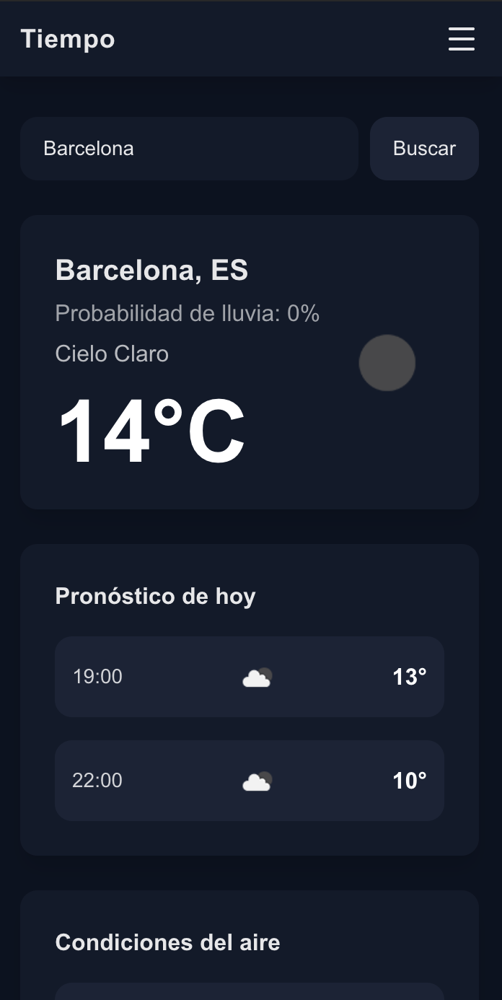
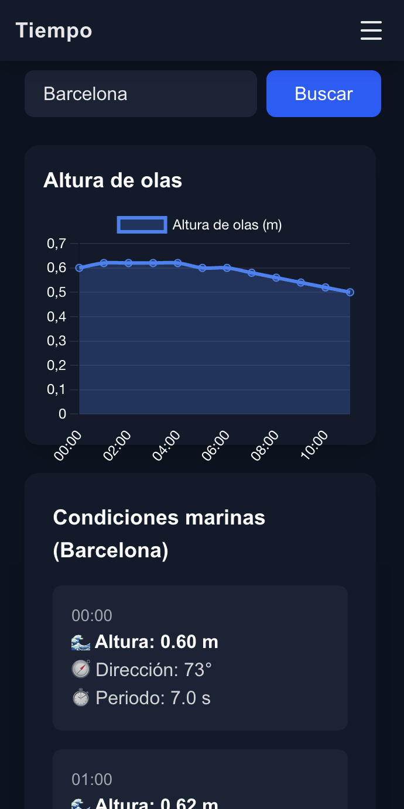
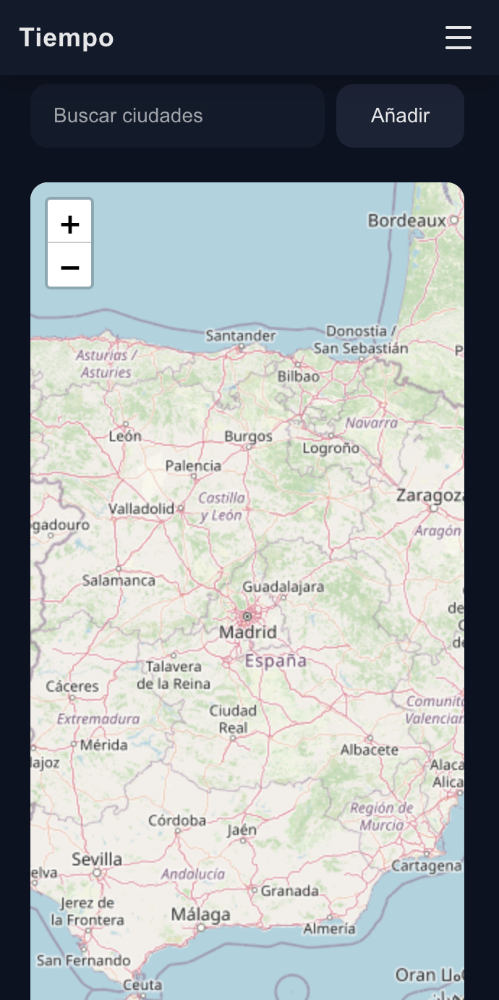

# App del clima

Aplicación web responsive (mobile-first) para consultar clima actual, pronóstico de hoy, condiciones del aire y pronóstico de 7 días, con gráficas sencillas.

## Demo
👉 [Ver demo en Vercel](https://app-del-clima-umber.vercel.app/)

## Tecnologías
- Next.js, React
- Tailwind CSS
- Chart.js
- OpenWeather API (clima), Open-Meteo (mar)

## Características

### 📌 Menú Clima
- **Buscador de ciudades con geolocalización inicial**: al abrir la app detecta tu ubicación y muestra el clima de tu ciudad, con opción de buscar manualmente otras.  
- **Pronóstico de hoy (por horas)**: tarjeta con las próximas horas, mostrando temperatura, iconos y evolución del tiempo durante el día.  
- **Condiciones del aire**: información detallada sobre sensación térmica, velocidad del viento, probabilidad de lluvia y nivel de radiación UV.  
- **Pronóstico de 7 días**: tarjeta con máximas y mínimas de la semana, iconos de estado del cielo y evolución de las condiciones.  
- **Evolución de temperaturas**: gráfica responsive que muestra la tendencia de temperaturas máximas y mínimas (7 días en escritorio, 3 días en móvil).

### 📌 Menú Ciudades
- **Buscador de ciudades**: permite localizar rápidamente cualquier ciudad del mundo.  
- **Dropdown de selección**: lista desplegable para cambiar entre ciudades guardadas o buscadas recientemente.  
- **Gestión sencilla**: facilita comparar condiciones meteorológicas entre diferentes ubicaciones.

### 📌 Menú Mapa
- **Mapa interactivo**: vista geográfica que permite explorar el mapa y añadir ciudades con un buscador.   
- **Visualización clara**: ayuda a ubicar la localización antes de consultar el pronóstico. 

### 📌 Menú Estado del mar
- **Buscador de ciudades costeras**: permite consultar condiciones marinas en cualquier ubicación.  
- **Gráfica de altura de olas (mobile-first)**: muestra la evolución de la altura de las olas en las próximas horas.  
- **Tarjetas de condiciones marinas**: información sobre altura, dirección y periodo de las olas.  
- **Condiciones de viento**: velocidad máxima y dirección dominante del día, complementando el estado del mar.  

## Instalación
1. Clonar el repositorio: git clone (Aquí pondré mi git)
2. Instalar dependencias: npm install
3. Crear archivo .env.local en la raíz del proyecto
API KEY: NEXT_PUBLIC_WEATHER_API_KEY=TU_API_KEY
4. Ejecutar en modo desarrollo: npm run dev

## Capturas

### Desktop 

#### Estado del mar

#### Clima

#### Mapa

---

### Mobile

#### Ciudades

#### Clima

#### Estado del mar

#### Mapa

## Licencia 
MIT 
